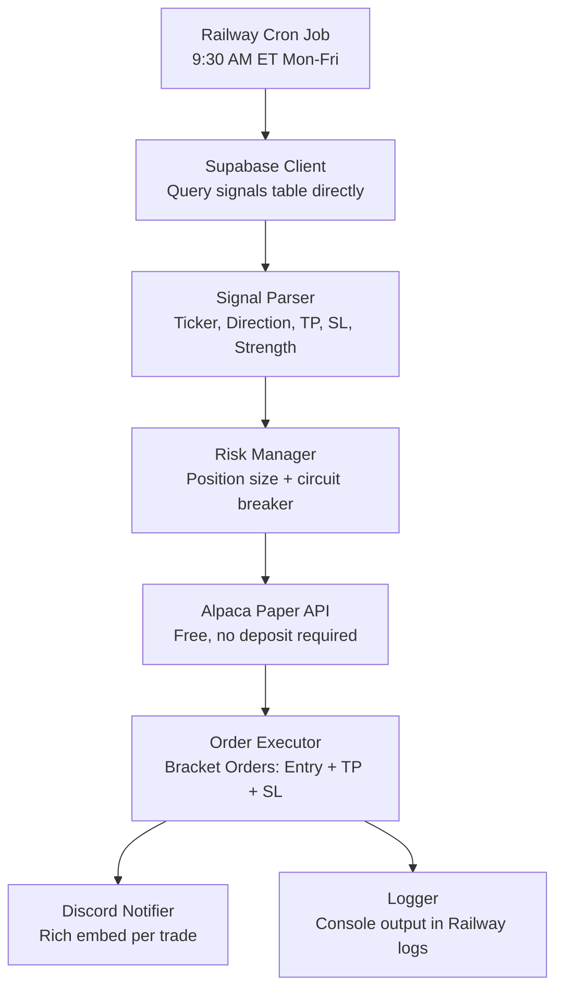

# Railway Auto-Trader: StockAI → Alpaca Paper Trading Bot

A fully automated trading pipeline that runs on Railway.app. Every market day at 9:30 AM ET, it reads today's signals directly from your Supabase `signals` table, applies strict risk management, executes paper trades via the Alpaca API, and notifies you on Discord.

---

## Architecture Overview



---

## Open Questions

> [!IMPORTANT]
> **Alpaca Account Required:** Sign up at https://alpaca.markets → switch to Paper Trading → generate API Key + Secret. Free, no deposit.

> [!IMPORTANT]
> **Discord Webhook Required:** In any Discord server you own: `Server Settings → Integrations → Webhooks → New Webhook`. Copy the URL.

> [!WARNING]
> **Supabase Key:** Use the **service role key** (not anon key) for the Railway server so it can read signals without being blocked by Row Level Security policies.

> [!WARNING]
> **Railway UTC Timezone:** Cron runs at 13:30 UTC = 9:30 AM EDT (Apr–Oct). In winter (EST), 9:30 AM = 14:30 UTC — we will handle this by checking Alpaca's market calendar at runtime so DST and holidays are handled automatically.

---

## Proposed Changes

### Component 1: Project Structure

```
stockai-trader/
├── Dockerfile               # python:3.12-slim (no browser needed!)
├── requirements.txt         # alpaca-py, supabase, pytz, requests
├── railway.toml             # cronSchedule = "30 13 * * 1-5"
├── .env.example             # Template for local dev
├── main.py                  # Orchestrator — runs once and exits
├── supabase_client.py       # Reads today's signals from Supabase
├── risk_manager.py          # Position sizing & circuit breaker
├── alpaca_client.py         # Bracket orders via Alpaca Paper API
├── discord_notifier.py      # Discord webhook rich embeds
└── logger.py                # Structured console logging
```

---

### Component 2: Supabase Signal Reader (`supabase_client.py`)

Replaces the old Playwright scraper entirely. Queries your `signals` table directly using the official Supabase Python client. Fast (~200ms), reliable, and returns typed data.

**Query logic:**
```python
signals = supabase.table("signals")
    .select("ticker, direction, take_profit, stop_loss, strength")
    .gte("created_at", today_start)
    .execute()
```

Returns a list of `Signal` dataclass objects — one per row found for today.

> [!NOTE]
> No HTML parsing, no browser, no CSS selectors. Just a direct DB query.

---

### Component 3: Risk Manager (`risk_manager.py`)

Enforces strict rules on every signal before an order is placed:

| Rule | Value |
|---|---|
| Max risk per trade | 1% of current account equity |
| Default stop loss | 5% below entry (if `stop_loss` is null in DB) |
| Position size formula | `shares = (equity × 0.01) ÷ (entry − stop_loss)` |
| Daily circuit breaker | Halt all trading if account is down 3% on the day |
| Min price filter | Skip tickers priced below $0.01 |

---

### Component 4: Alpaca Client (`alpaca_client.py`)

Wraps the official `alpaca-py` SDK pointed at the **Paper Trading** base URL.

Handles:
- Auth via `ALPACA_API_KEY` + `ALPACA_SECRET_KEY`
- Confirming market is open today via Alpaca's calendar API (handles holidays + DST automatically)
- Fetching current account equity for the risk manager
- Submitting **bracket orders** — a single atomic request with entry price, take profit limit, and stop loss stop all in one call
- Querying open positions for the end-of-day summary

> [!NOTE]
> Alpaca bracket orders are far cleaner than Webull's manual two-step approach. One API call = entry + TP + SL all set simultaneously. No risk of placing an entry without a stop loss attached.

---

### Component 5: Discord Notifier (`discord_notifier.py`)

Sends color-coded rich embeds to your Discord server via a webhook URL. No bot token required.

| Event | Color | Content |
|---|---|---|
| 🚀 **Session Start** | Blue | "StockAI Bot is live — N signals found today" + signal list |
| ✅ **Trade Placed** | Green | Ticker, side, shares, entry price, TP target, SL level |
| ⚠️ **Trade Skipped** | Yellow | Ticker + reason (market closed, risk rejected, not on Alpaca) |
| 🔴 **Circuit Breaker** | Red | "Account down 3% — trading halted for today" |
| 🏁 **Session End** | Purple | Total trades placed, net P&L, final account equity |

---

### Component 6: Main Orchestrator (`main.py`)

The single script Railway executes on the cron schedule. Runs once and exits cleanly.

**Execution flow:**
1. Connect to Alpaca — confirm market is open today (exit silently if not)
2. Fetch current account equity
3. Query Supabase `signals` table for today's rows
4. Send 🚀 **Discord Session Start** embed
5. For each signal:
   - Run through risk manager (calculate shares, validate SL)
   - Submit bracket order via Alpaca
   - Send ✅ or ⚠️ Discord embed
   - Check circuit breaker — halt if triggered
6. Send 🏁 **Discord Session End** summary
7. Exit with code `0`

Supports `--dry-run` flag: reads signals + calculates sizes, but submits no orders and sends no Discord messages.

---

### Component 7: Railway Config (`railway.toml` + `Dockerfile`)

**Cron Schedule:** `30 13 * * 1-5`
_(13:30 UTC = 9:30 AM EDT Mon–Fri. Alpaca market calendar check handles EST/DST drift.)_

**Dockerfile:** Simple `python:3.12-slim` — no browser, no system deps needed.

**Environment Variables** (set in Railway dashboard, never in code):

| Variable | Where to find it |
|---|---|
| `SUPABASE_URL` | Supabase → Project Settings → API |
| `SUPABASE_SERVICE_KEY` | Supabase → Project Settings → API → service_role |
| `ALPACA_API_KEY` | Alpaca dashboard → Paper Trading section |
| `ALPACA_SECRET_KEY` | Alpaca dashboard → Paper Trading section |
| `DISCORD_WEBHOOK_URL` | Discord → Server Settings → Integrations → Webhooks |
| `MAX_RISK_PCT` | Optional, defaults to `0.01` (1%) |

---

## Verification Plan

### Local Dry Run
```bash
pip install -r requirements.txt
python main.py --dry-run
```
Reads today's signals from Supabase and prints calculated bracket order parameters to the console. Zero trades submitted, zero Discord messages sent.

### Railway Deployment Check
1. Push to GitHub → connect to a new Railway project
2. Set all environment variables in the Railway dashboard
3. Manually trigger a run from the Railway dashboard
4. Verify Railway logs show signals were read and orders submitted
5. Verify Alpaca Paper Trading dashboard shows new open positions with correct TP/SL
6. Verify Discord received the trade notification embeds
